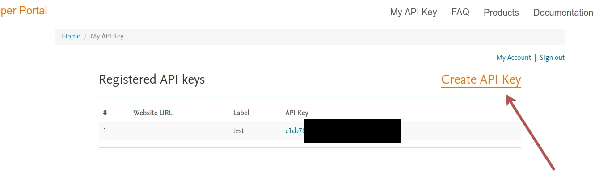
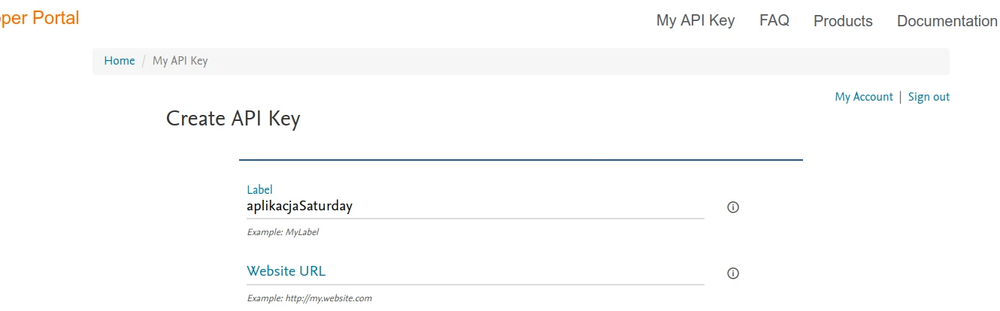
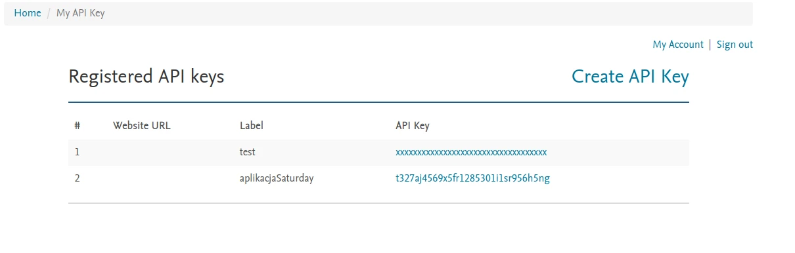

# API Elsevier (Scopus)

Moduł pobierający dane z oficjalnego API. Jego zaletą jest prosta konfiguracja i niezawodność, natomiast głównymi
wadami są: 
- mniejsza ilość informacji niż w przypadku bramki eksportu Scopusa;
- tygodniowy limit pobranych danych.

## Konfiguracja

### Tworzenie klucza API
Aby móc używać tego modułu należy stworzyć klucz API na stronie 
[https://dev.elsevier.com/apikey/manage](https://dev.elsevier.com/apikey/manage). Klucz ten będzie powiązany z kontem
użytkownika.


<p class="text--italic" aria-hidden="true">Zrzut ekranu ze strzałką wskazującą na przycisk Create API Key</p>

Kluczowi należy nadać krótką nazwę (Label). Pole do wpisania adresu URL strony można zostawić puste. Następnie trzeba
zaakceptować regulamin usługi i nacisnąć "Submit".

<p class="text--italic" aria-hidden="true">Zrzut ekranu pokazujący pola nazwy klucza oraz adresu URL strony</p>

Po zatwierdzeniu przeglądarka powróci do widoku listy stworzonych kluczy. Kluczem API jest losowy ciąg znaków 
o długości 32 liter i cyfr. 

<p class="text--italic" aria-hidden="true">Zrzut ekranu pokazujący listę kluczy API</p>

:::warning

Nie należy udostępniać swojego klucza API. Pozwoliłoby to osobom trzecim na nieautoryzowany dostęp do Elseviera.
Pokazany na zrzucie ekranu klucz nie jest prawdziwy.

:::

### Wprowadzenie klucza w aplikacji
Stworzony klucz należy przekazać aplikacji jako zmienną środowiskową. Program obsługuje pliki .env, które pozwalają
takie zmienne zapisać w pliku.

W katalogu aplikacji (w którym znajduje się np. plik README.md) należy utworzyć plik `.env` (można użyć pliku 
`.env.sample` jako wzoru).

Następnie wkleić klucz jako wartość zmiennej `SCOPUS_API_KEY`:
```
SCOPUS_API_BASE=https://api.elsevier.com
SCOPUS_API_KEY=t327aj4569x5fr1285301i1sr956h5ng

[...]
```

### Adres bazowy

:::info

Ten krok nie jest wymagany podczas codziennego użytkowania. Zmiana adresu bazowego jest przydatna głównie 
dla programistów.

:::

Możliwa jest zmiana adresu bazowego, na który będą domyślnie wysyłane żądania. Adres ten konfiguruje się zmienną
`SCOPUS_API_BASE`. Jego domyślna wartość to `https://api.elsevier.com` (oficjalny adres).

Jeżeli zmienimy adres na przykładowo `https://example.org`, to aplikacja, zamiast wysyłać żądania do oficjalnego serwera
Elseviera, będzie je wysyłać na ten właśnie adres. 

Jest to przydatne podczas testowania aplikacji, gdy mamy swój własny serwer, który zachowuje się dokładnie tak samo
(albo podobnie) jak oficjalne API Elsevier. 