# Scopus batch (bramka eksportu)

Moduł pobierający dane za pomocą bramki eksportu Scopusa. Jego zaletą jest ilość dostępnych informacji, natomiast
wadami:
- trudniejsza konfiguracja (eksportowanie ciasteczek z przeglądarki);
- potrzeba parsowania danych — program może źle odczytać dane.

## Konfiguracja

Aby móc używać tego modułu należy wyeksportować ciasteczka sesji z przeglądarki po zalogowaniu do interfejsu Scopusa.

:::warning

Dostęp do Scopusa jest przydzielany również na podstawie adresu IP, a nie tylko konta. Program może nie być w stanie
pobrać danych z nieautoryzowanej sieci.

:::

### Ciasteczka

Aby wyeksportować ciasteczka, najpierw należy zalogować się do Scopusa i następnie przejść 
do strony wyszukiwania: [https://www.scopus.com/search/form.uri](https://www.scopus.com/search/form.uri).

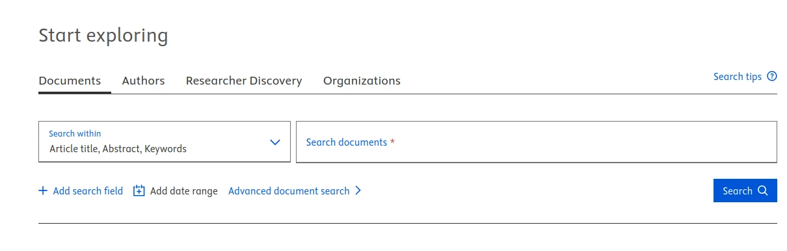
<p class="text--italic" aria-hidden="true">Zrzut ekranu przedstawiający formularz wyszukiwania Scopusa</p>

:::tip

Na potrzeby programu, najlepiej zalogować się w trybie incognito przeglądarki. Wtedy mamy pewność, że aplikacja
nie wpłynie na sesję używaną przez użytkownika.

:::

Ciasteczka najłatwiej wyeksportować za pomocą narzędzi deweloperskich. Poniżej znajduje się opis 
dla dwóch przeglądarek.

#### Firefox

Należy uruchomić narzędzia deweloperskie poprzez kliknięcie prawym przyciskiem myszy gdziekolwiek na stronie 
i wybranie pozycji "Inspect" (lub też "Zbadaj element").
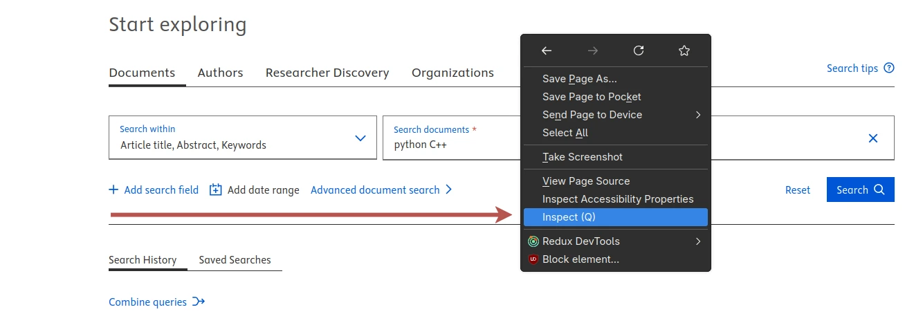
<p class="text--italic" aria-hidden="true">Zrzut ekranu przedstawiający menu kontekstowe Firefoxa</p>

Na dole okna przeglądarki powinny pojawić się narzędzia deweloperskie. Należy wybrać opcję "Network" ("Sieć").
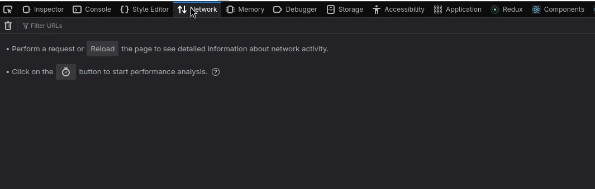
<p class="text--italic" aria-hidden="true">Zrzut ekranu przedstawiający narzędzia deweloperskie Firefoxa</p>

Konieczne jest włączenie opcji "Persist Logs" oraz ustawienie filtru na "XHR".
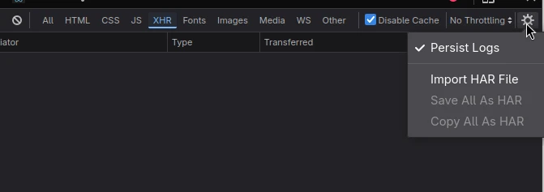
<p class="text--italic" aria-hidden="true">Zrzut ekranu przedstawiający włączoną opcję Persist logs oraz ustawiony filtr XHR</p>

Następnie należy cokolwiek wyszukać za pomocą formularza. Spowoduje to wysłanie żądania, z którego będzie można
wyeksportować ciasteczka.

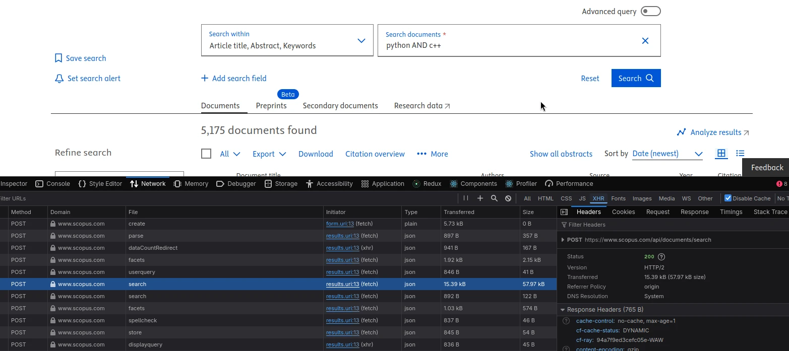
<p class="text--italic" aria-hidden="true">Zrzut ekranu przedstawiający pomyślnie wykonane wyszukanie "python C++"</p>

W oknie narzędzi deweloperskich powinny pojawić się żądania. Należy wybrać którekolwiek z dostępnych (na zrzucie
wybrane zostało żądanie do "pliku" `search`).

Po wybraniu żądania, w oknie szczegółów o żądaniu trzeba zjechać do nagłówka "Cookie" (wartość będzie
dość długa). Po znalezieniu nagłówka należy nacisnąć prawym przyciskiem myszy na wartość i wybrać "Copy value".
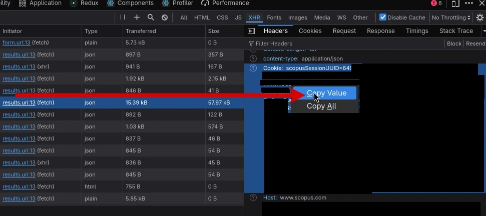
<p class="text--italic" aria-hidden="true">Zrzut ekranu przedstawiający kopiowanie wartości nagłówka Cookie</p>

:::tip

Wartość nagłówka niekoniecznie musi zaczynać się od ciasteczka `scopusSessionUUID`.

:::

:::warning

Pod żadnym pozorem nie należy udostępniać swoich ciasteczek.

:::

Skopiowane ciasteczka należy zapisać do pliku tekstowego, gdzieś w komputerze. Następnie należy zamknąć okno 
przeglądarki (lub kartę), aby ta nie wpływała na sesję.

<p class="text--italic" aria-hidden="true">Zrzut ekranu przedstawiający plik z ciasteczkami</p>


#### Google Chrome

Należy uruchomić narzędzia deweloperskie poprzez kliknięcie prawym przyciskiem myszy gdziekolwiek na stronie 
i wybranie pozycji "Inspect" (lub też "Zbadaj").
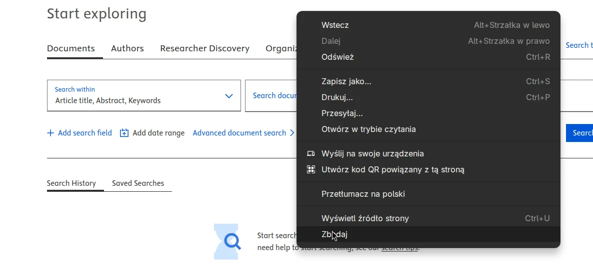
<p class="text--italic" aria-hidden="true">Zrzut ekranu przedstawiający menu kontekstowe Chrome'a</p>

Powinny pojawić się narzędzia deweloperskie. Należy wybrać opcję "Network" ("Sieć"). Konieczne jest włączenie 
opcji "Preserve log" oraz ustawienie filtru na "Fetch/XHR".
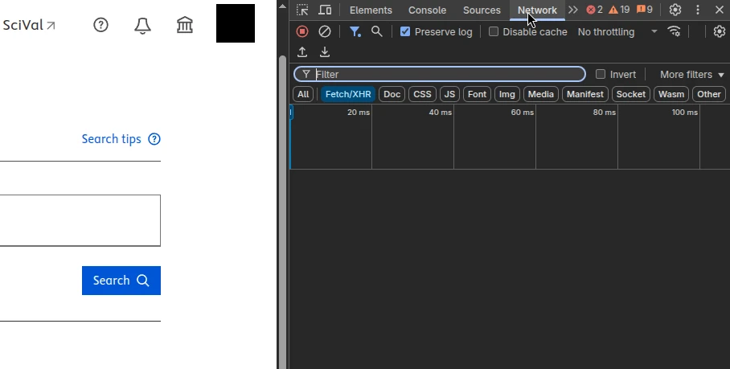
<p class="text--italic" aria-hidden="true">Zrzut ekranu przedstawiający narzędzia deweloperskie Chrome'a</p>

Następnie należy cokolwiek wyszukać za pomocą formularza. Spowoduje to wysłanie żądania, z którego będzie można
wyeksportować ciasteczka.

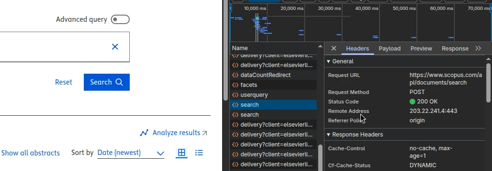
<p class="text--italic" aria-hidden="true">Zrzut ekranu przedstawiający pomyślnie wykonane wyszukanie "python C++"</p>

W oknie narzędzi deweloperskich powinny pojawić się żądania. Należy wybrać którekolwiek z dostępnych (na zrzucie
wybrane zostało żądanie do "pliku" `search`).

Po wybraniu żądania, w oknie szczegółów o żądaniu trzeba zjechać do nagłówka "Cookie" (wartość będzie
dość długa). Po znalezieniu nagłówka należy zaznaczyć całą wartość, nacisnąć prawym przyciskiem myszy na zaznaczenie 
i wybrać "Copy" ("Kopiuj").
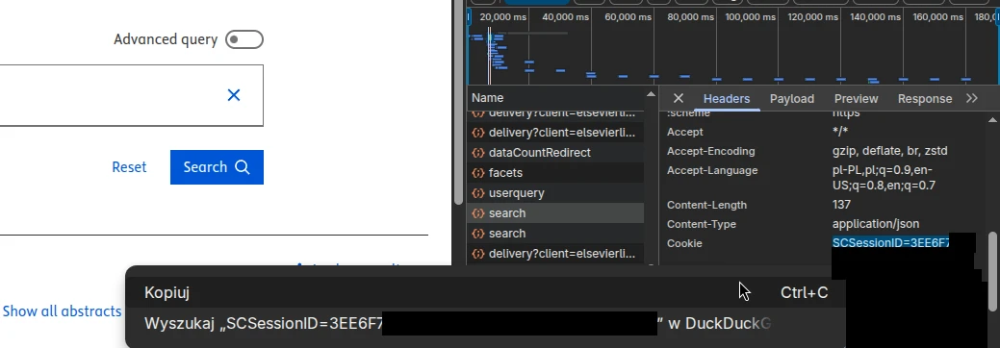
<p class="text--italic" aria-hidden="true">Zrzut ekranu przedstawiający kopiowanie wartości nagłówka Cookie</p>

:::tip

Wartość nagłówka niekoniecznie musi zaczynać się od ciasteczka `SCSessionID`.

:::

:::warning

Pod żadnym pozorem nie należy udostępniać swoich ciasteczek.

:::

Skopiowane ciasteczka należy zapisać do pliku tekstowego, gdzieś w komputerze. Następnie należy zamknąć okno 
przeglądarki (lub kartę), aby ta nie wpływała na sesję.
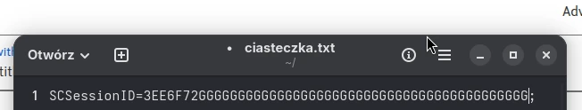
<p class="text--italic" aria-hidden="true">Zrzut ekranu przedstawiający plik z ciasteczkami</p>

### User-Agent
Do działania modułu potrzebna jest również wartość nagłówka "User-Agent". Można ją pozyskać wykonując proste
zapytanie w Google: "what is my user agent". Wyszukiwarka powinna zwrócić nam naszą wartość.
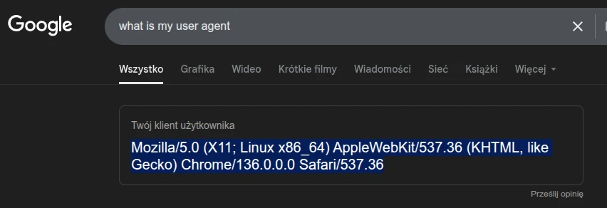
<p class="text--italic" aria-hidden="true">Zrzut ekranu przedstawiający zapytanie w Google o "klient użytkownika"</p>

### Wprowadzenie danych w aplikacji
Ciasteczka i User-Agent można przekazać aplikacji za pomocą zmiennych środowiskowych lub też pliku .env.

W katalogu aplikacji (w którym znajduje się np. plik README.md) należy utworzyć plik `.env` (można użyć pliku 
`.env.sample` jako wzoru).

Następnie podać ścieżkę do pliku z ciasteczka jako wartość zmiennej `SCOPUS_BATCH_COOKIE_FILE` oraz klient użytkownika
jako wartość zmiennej `SCOPUS_BATCH_USER_AGENT`:
```
[...]

SCOPUS_BATCH_BASE=https://www.scopus.com
SCOPUS_BATCH_COOKIE_FILE=C:\Users\admin\Desktop\ciasteczka.txt
SCOPUS_BATCH_COOKIE_JWT_DOMAIN=.scopus.com
SCOPUS_BATCH_USER_AGENT=Mozilla/5.0 (X11; Linux x86_64) AppleWebKit/537.36 (KHTML, like Gecko) Chrome/136.0.0.0 Safari/537.36

[...]
```

### Adres bazowy i domena ciasteczka
:::info

Ten krok nie jest wymagany podczas codziennego użytkowania. Zmiana adresu bazowego jest przydatna głównie 
dla programistów.

:::

Możliwa jest zmiana adresu bazowego, na który będą domyślnie wysyłane żądania. Adres ten konfiguruje się zmienną
`SCOPUS_BATCH_BASE`. Jego domyślna wartość to `https://www.scopus.com` (oficjalny adres).

Jeżeli zmienimy adres na przykładowo `https://example.org`, to aplikacja, zamiast wysyłać żądania do oficjalnego serwera
Elseviera, będzie je wysyłać na ten właśnie adres. 

Jest to przydatne podczas testowania aplikacji, gdy mamy swój własny serwer, który zachowuje się dokładnie tak samo
(albo podobnie) jak backend interfejsu Scopusa. 


:::warning

Przy zmianie adresu bazowego należy również ustawić odpowiadającą mu domenę ciasteczka `SCOPUS_JWT`. W innym przypadku
klient HTTP może albo nie wysyłać tego ciasteczka, albo w razie odświeżenia źle je zapisać.

:::

## Użycie
Modułu bramki eksportu możemy używać zarówno z poziomu interfejsu konsolowego, jak i z graficznego. 

### Konsolowo
```shell
$ main.py --scopus-batch "python C++"

INFO:__main__:Using "python C++" as the search query
DEBUG:cli.scopus_batch:using Scopus batch export
INFO:cli.scopus_batch:all required Scopus batch cookies were found
INFO:fetcher.scopus_batch.scraper:export_all: exported 100/5135
INFO:fetcher.scopus_batch.scraper:export_all: exported 200/5135
INFO:fetcher.scopus_batch.scraper:export_all: exported 300/5135
INFO:fetcher.scopus_batch.scraper:export_all: exported 400/5135
[...]
```

### Graficznie
TODO: 