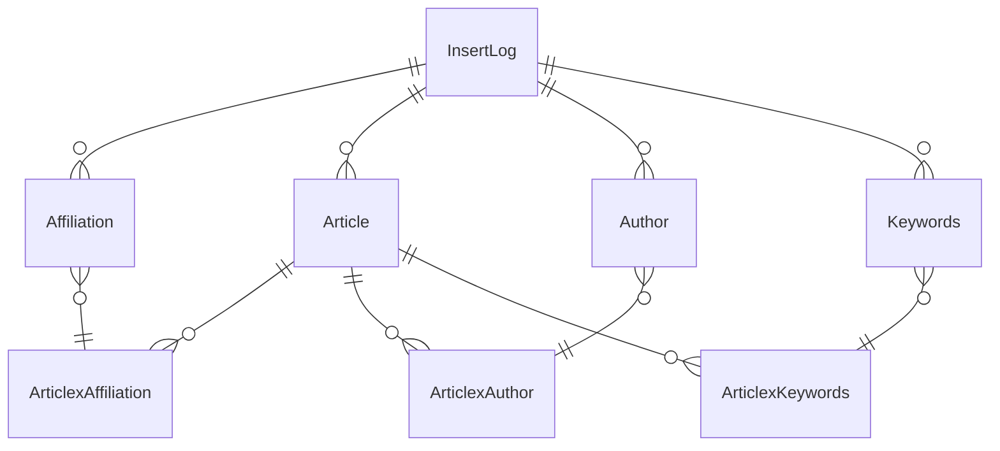

# Baza danych

Baza danych wykorzystuje silnik SQLite.

## Diagram

## Tabele

### Affiliation
Przechowuje informacje o afiliacjach (instytucjach).
- **ID** (PK, AUTOINCREMENT) - Unikalny identyfikator
- **SourceID** - ID z systemu źródłowego
- **SourceURL** - URL źródła
- **Name** (NOT NULL) - Nazwa instytucji
- **Country** - Kraj
- **City** - Miasto
- **InsertID** (FK do InsertLog) - Referencja do logu insertów

### Article
Przechowuje metadane artykułów naukowych.
- **ID** (PK, AUTOINCREMENT) - Unikalny identyfikator
- **SourceID** - ID z systemu źródłowego
- **SourceURL** - URL źródła
- **Name** (NOT NULL) - Tytuł artykułu
- **PublishDate** - Data publikacji
- **ISSN/EISSN** - Numery ISSN
- **DOI** - Cyfrowy identyfikator
- **Publisher** - Wydawca
- **Volume** - Tom czasopisma
- **Description** - Opis/abstrakt
- **Type/SubType** - Typ i podtyp publikacji
- **CitedByCount** - Liczba cytowań
- **Sponsor** - Sponsor publikacji
- **InsertID** (FK do InsertLog) - Referencja do logu insertów

### Author
Przechowuje informacje o autorach.
- **ID** (PK, AUTOINCREMENT) - Unikalny identyfikator
- **SourceID** - ID z systemu źródłowego
- **SourceURL** - URL źródła
- **FullName** (NOT NULL) - Pełne imię i nazwisko
- **FirstName** - Imię
- **SureName** - Nazwisko
- **Initials** - Inicjały
- **InsertID** (FK do InsertLog) - Referencja do logu insertów

### Keywords
Przechowuje słowa kluczowe.
- **ID** (PK) - Unikalny identyfikator
- **Keyword** - Słowo kluczowe
- **InsertID** (FK do InsertLog) - Referencja do logu insertów

### InsertLog
Loguje operacje dodawania danych.
- **ID** (PK, AUTOINCREMENT) - Unikalny identyfikator
- **InsertTimestamp** (DEFAULT CURRENT_TIMESTAMP) - Znacznik czasowy
- **ArticleInsertCount** - Liczba dodanych artykułów
- **Source** - Źródło danych

### Tabele łączące (many-to-many)
1. **ArticlexAffiliation** - Łączy artykuły z afiliacjami
   - ArticleID (FK do Article)
   - AffiliationID (FK do Affiliation)

2. **ArticlexAuthor** - Łączy artykuły z autorami
   - ArticleID (FK do Article)
   - AuthorID (FK do Author)

3. **ArticlexKeywords** - Łączy artykuły ze słowami kluczowymi
   - ArticleID (FK do Article)
   - KeywordsID (FK do Keywords)

## Klucze obce
- Wszystkie tabele posiadają pole `InsertID` odwołujące się do `InsertLog(ID)`
- Tabele łączące posiadają klucze obce do odpowiednich encji

## Indeksy
- `idx_author_sourceid` na Author(SourceID)
- `idx_affiliation_sourceid` na Affiliation(SourceID)
- `idx_keywords_keyword` na Keywords(Keyword)