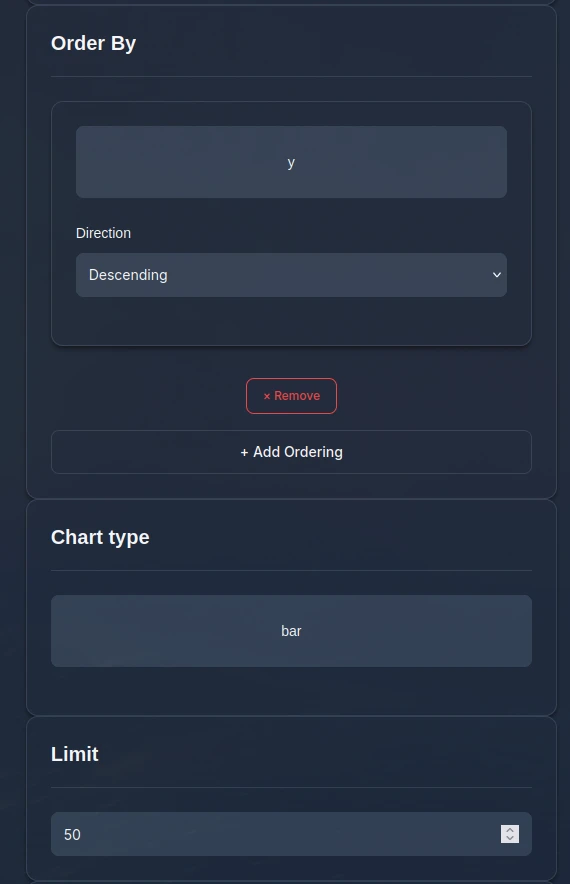

# Interfejs graficzny (webowy)

Jedną z opcji korzystania z programu jest interfejs graficzny. Za jego pomocą można pobierać dane oraz tworzyć wykresy.

## Uruchamianie

Interfejs graficzny można uruchomić zarówno za pomocą zbudowanego pliku `gui.exe`, jak i za pomocą skryptu.

Zbudowany plik nie wymaga instalacji żadnych innych programów. Wystarczy dwa razy kliknąć plik:

<video controls preload='metadata' class="saturday-video" aria-hidden="true">
    <source src={require('./assets/gui-7.webm').default} />
</video>

Następnie należy w przeglądarce otworzyć adres: [http://127.0.0.1:5000/ui](http://127.0.0.1:5000/ui).

## Pobieranie danych

Pobieranie danych jest dostępne w zakładce "Fetch data". Po wpisaniu kwerendy możemy wybrać pobieranie jednym 
z modułów albo wszystkimi.

Zrzut ekranu pokazujący zakładę "Fetch data"

## Wykresy

Za pomocą interfejsu graficznego można tworzyć różne wykresy, na podstawie pobranych wcześniej danych.

### Przykład

Aby stworzyć wykres przedstawiający ilość publikacji w zależności od autora, należy na początek ustawić
oś X tak, aby przedstawiała autorów (oraz identyfikujące ich pole, np. imię i nazwisko).

Zrzut ekranu pokazujący ustawienia osi X

Następnie trzeba skonfigurować oś Y tak, aby znajdowała się na niej liczba artykułów. Do tego służy funkcja `count`.

Zrzut ekranu pokazujący ustawienia osi Y

Należy jeszcze wybrać typ wykresu (przykładowo słupkowy), oraz opcjonalnie ustawić limit na osi X oraz sortowanie.

Zrzut ekranu pokazujący dodatkowe ustawienia

Na koniec trzeba nadać nazwę wykresowi i nacisnąć przycisk "Submit Query".

Zrzut ekranu pokazujący dodatkowe ustawienia #2

Po chwili powinien pojawić się wykres oraz odpowiadająca mu tabela danych.

Zrzut ekranu przedstawiający wygenerowany wykres

